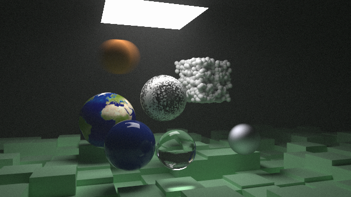

# Basic Ray Tracing (BRT)

An implementation of a CPU Ray Tracing engine, created by following the "Ray Tracing in One Weekend" tutorial (actually, it took me nearly one week for the first part).



## Build

Use `cmake` (once) to configure de build:


```
cd build
cmake ..
```

and `make` to build (and rebuild) the project, on the `build/` directory:

```
make
```

## Usage

Simply run the build executable (`build/BasicRayTracing`), and place the output (stdout) PPM on a file:

```
build/BasicRayTracing > output.ppm
```

## Resources

- [Ray Tracing in One Weekend - The Book Series](https://raytracing.github.io/): the main tutorial
- [stb](https://github.com/nothings/stb): header-only image library
