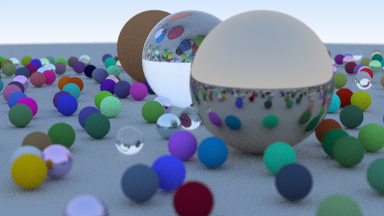

# Basic Ray Tracing (BRT)

My own version of the CPU Ray Tracing engine, created by following the _"Ray Tracing in One
Weekend"_ tutorial (actually, it took me nearly one week, but close enough).



## Build

Use cmake to build the project:

```
cd build
cmake ..
make
```

## Usage

Simply run the build executable, and place the output PPM on a file:

```
build/BasicRayTracing > output.ppm
```

## Resources

- [Ray Tracing in One Weekend](https://raytracing.github.io/books/RayTracingInOneWeekend.html)
